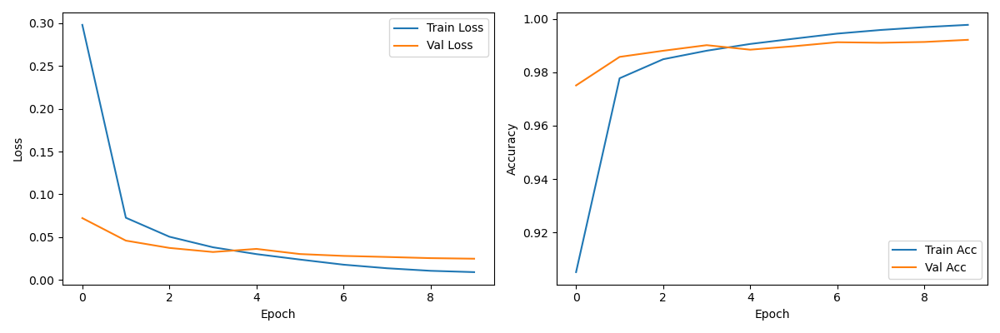
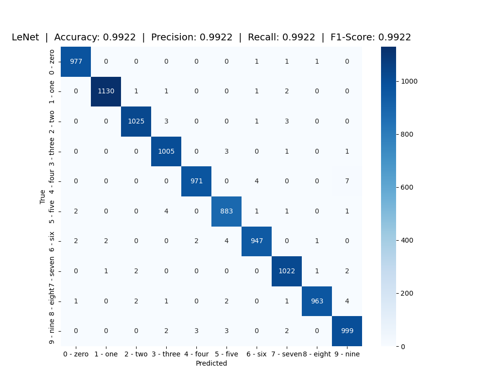

# LeNet-5_PyTorch
使用 PyTorch 實現 LeNet-5 神經網路來進行 MNIST 數據集分類

## MNIST 數據集
MNIST（Modified National Institute of Standards and Technology）是一個廣泛用於機器學習和深度學習的手寫數字圖像數據集。它由70,000張28x28像素的灰度圖片組成，每張圖片都包含一個手寫的單一數字，從0到9。


## LeNet
LeNet（LeNet-5）是由Yann LeCun等人於1998年提出的卷積神經網絡（Convolutional Neural Network, CNN）架構，是深度學習領域中的經典模型之一。


## 訓練模型
```bash
python train.py
```

## 測試模型
```bash
python test.py
```

## 專案結構
* `train.py` ： 用於訓練模型的腳本

* `test.py` ： 用於測試模型的腳本

* `model/LeNet.py` ： LeNet-5 神經網路的定義

* `dataset.py` ： 用於下載和處理 MNIST 數據集的腳本

* `config.json` ： 訓練時的超參數設定
## 參考文獻
### **Gradient-based learning applied to document recognition**
_Y. Lecun, L. Bottou, Y. Bengio, P. Haffner_

**Abstract**  

Multilayer neural networks trained with the back-propagation algorithm constitute the best example of a successful gradient based learning technique. Given an appropriate network architecture, gradient-based learning algorithms can be used to synthesize a complex decision surface that can classify high-dimensional patterns, such as handwritten characters, with minimal preprocessing. This paper reviews various methods applied to handwritten character recognition and compares them on a standard handwritten digit recognition task. Convolutional neural networks, which are specifically designed to deal with the variability of 2D shapes, are shown to outperform all other techniques. Real-life document recognition systems are composed of multiple modules including field extraction, segmentation recognition, and language modeling. A new learning paradigm, called graph transformer networks (GTN), allows such multimodule systems to be trained globally using gradient-based methods so as to minimize an overall performance measure. Two systems for online handwriting recognition are described. Experiments demonstrate the advantage of global training, and the flexibility of graph transformer networks. A graph transformer network for reading a bank cheque is also described. It uses convolutional neural network character recognizers combined with global training techniques to provide record accuracy on business and personal cheques. It is deployed commercially and reads several million cheques per day.  
[[Paper]](https://ieeexplore.ieee.org/document/726791)
```bash
@article{LeNet-5,
    title = {Gradient-based learning applied to document recognition},
    author = {Y. Lecun, L. Bottou, Y. Bengio, P. Haffner},
    journal = {IEEE},
    year = {1998}
}
```